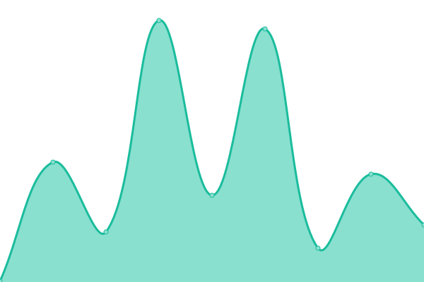
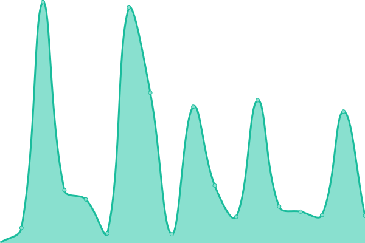
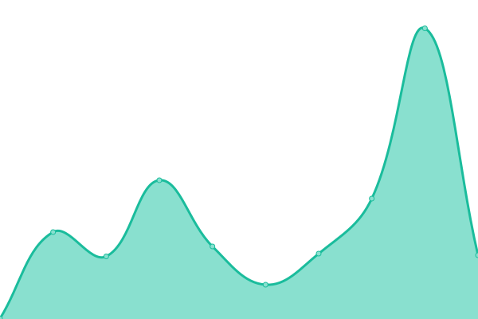

# [📈 Live Status](https://upptime.github.io/upptime): <!--live status--> **🟧 Partial outage**

This repository contains the open-source uptime monitor and status page for [Upptime](https://upptime.js.org), powered by [Upptime](https://github.com/upptime/upptime).

With [Upptime](https://upptime.js.org), you can get your own unlimited and free uptime monitor and status page, powered entirely by a GitHub repository. We use [Issues](https://github.com/upptime/upptime/issues) as incident reports, [Actions](https://github.com/cad-dmendel/upptime/actions) as uptime monitors, and [Pages](https://upptime.github.io/upptime) for the status page.

<!--start: status pages-->
<!-- This summary is generated by Upptime (https://github.com/upptime/upptime) -->
<!-- Do not edit this manually, your changes will be overwritten -->
<!-- prettier-ignore -->
| URL | Status | History | Response Time | Uptime |
| --- | ------ | ------- | ------------- | ------ |
|  [Authenticator](https://authenticator.cadastra.com) | 🟩 Up | [authenticator.yml](https://github.com/cad-dmendel/uptime/commits/HEAD/history/authenticator.yml) | 

 215ms
     
 | 

<a href="https://cad-dmendel.github.io/uptime/history/authenticator">100.00%</a>
    

|  [Metabase](https://metabase.cadastra.com) | 🟥 Down | [metabase.yml](https://github.com/cad-dmendel/uptime/commits/HEAD/history/metabase.yml) | 

 416ms
     
 | 

<a href="https://cad-dmendel.github.io/uptime/history/metabase">100.00%</a>
    

|  [GitLab](https://gitlab.cadastra.com) | 🟩 Up | [git-lab.yml](https://github.com/cad-dmendel/uptime/commits/HEAD/history/git-lab.yml) | 

 236ms
     
 | 

<a href="https://cad-dmendel.github.io/uptime/history/git-lab">100.00%</a>
    

<!--end: status pages-->

[**Visit our status website →**](https://upptime.github.io/upptime)

## 📄 License

- Powered by: [Upptime](https://github.com/upptime/upptime)
- Code: [MIT](./LICENSE) © [Upptime](https://upptime.js.org)
- Data in the `./history` directory: [Open Database License](https://opendatacommons.org/licenses/odbl/1-0/)
